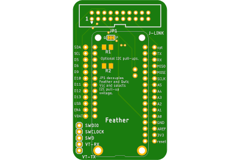
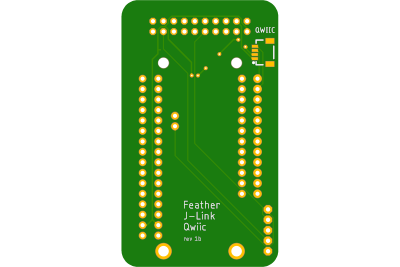

# Feather w/ J-Link & Qwiic
  * Provides:
    * access to:
      * all Feather pins
      * SWDIO and SWCLOCK software debugging pins
    * the option for adding a Segger J-Link connector and access to its additional pins
    * solder pads for a Qwiic/STEMMA QT I2C connector
    * solder pads for I2C pull-up resistors (SMD 1206 size)
  * Fabricated and tested to some degree for different projects.

 

## Directory Contents

__Board directories__ typically contain the following:
  * Eagle PCB .brd (board) and .sch (schematic) files.
  * all Gerber files for manufacturing in a zip file
  * The schematic rendered as PDF.
  * Renderings of the board, top and bottom, and maybe a photo of a populated board.