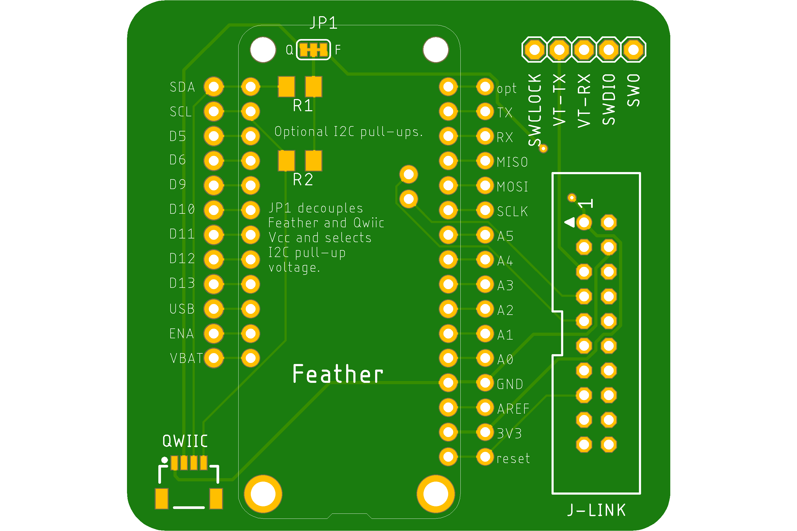
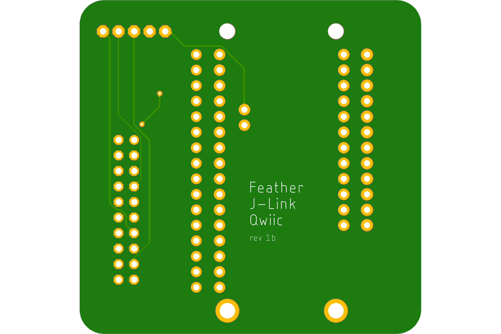

# Feather w/ J-Link & Qwiic (Wide Form Factor)
* Provides:
    * access to:
      * all Feather pins
      * SWDIO and SWCLOCK software debugging pins
    * the option for adding a Segger J-Link connector and access to its additional pins
    * solder pads for a Qwiic/STEMMA QT I2C connector
    * solder pads for I2C pull-up resistors (SMD 1206 size)
* Same [schematic](../Feather_J-Link_Qwiic-schematic.png) as the narrow board.
* Fab pending.

  

## Directory Contents

__Board directories__ typically contain the following:
  * all Gerber files for manufacturing in a zip file
  * The schematic rendered as PDF.
  * Renderings of the board, top and bottom, and maybe a photo of a populated board.