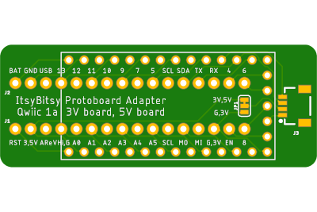

# ItsyBitsy 32u4 3 & 5V
  * exposes unique pins in (2) 0.3" 16-pin headers so that they can be plugged into a protoboard
  * Qwiic version adds a SMD pad for a 4-cond JST SH Qwiic/STEMMA QT connector and a cut/solder pad for selecting 3 or 5V Qwiic Vcc.
  * The IB Qwiic board have been fabricated so I can soon mark it as Validated.
  * To Do:

__Board directories__ typically contain the following:
  * Eagle PCB .brd (board) and .sch (schematic) files.
  * all Gerber files for manufacturing in a zip file
  * The schematic rendered as PDF.
  * Renderings of the board, top and bottom, and maybe a photo of a populated board.