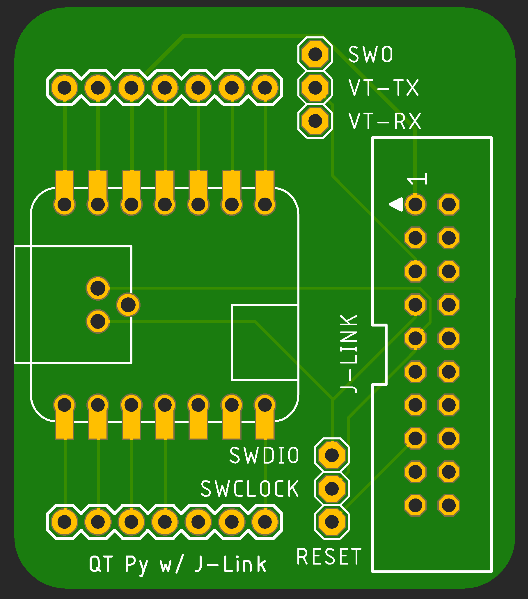
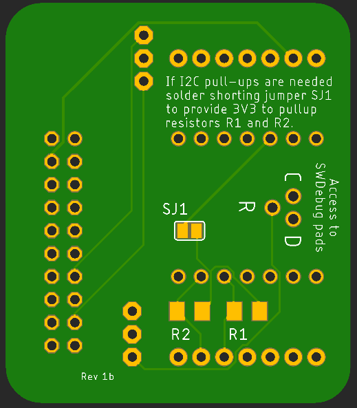
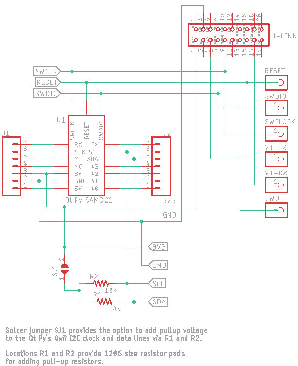

# Qt Py Breakout with J-Link

This board breaks out the pins for Adafruit's Qt Py SAMD21 Cortex M0 board. Additionally, it provide through-hole access to the SWDebug pads underneath using Pogp pin style probes. Headers pins for all Qt Py pins and J-Link signals can be added as well as a J-Link IDC connector.

## Files

Eagle board and schematic files are provided, as well as the zip file containing the Gerber files necessary for fabrication.

## Board Status

2022-09-21 This board is about to be released for fabrication and is therefore unverified (especially the SWD pads.

## Board Images

## Schematic

<u></u>