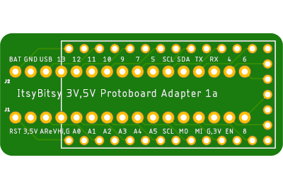

# Breakout-Boards

## Introduction

This is my collection of various breakout boards that do one or more of the following:
  * expose a removable MCU board's pins for headers or soldering
  * make edge-pinned boards like Adafruit's ItsyBitsy adaptable to a protoboard
  * add an I2C Qwiic/STEMMA QT port
  * expose debug pins SWDIO and SWCLK (SAMD21/M0) and the option for a Segger J-Link connector.

## Directory

### ItsyBitsy 32u4 3 & 5V
  * exposes unique pins in (2) 0.3" 16-pin headers so that they can be plugged into a protoboard
  * Qwiic version adds a SMD pad for a 4-cond JST SH Qwiic/STEMMA QT connector and a cut/solder pad for selecting 3 or 5V Qwiic Vcc.
  * The IB Qwiic board have been fabricated so I can soon mark it as Validated.
  * To Do:

 

### Feather w/ J-Link & Qwiic
  * Fabricated and tested to some degree for different projects.

 
